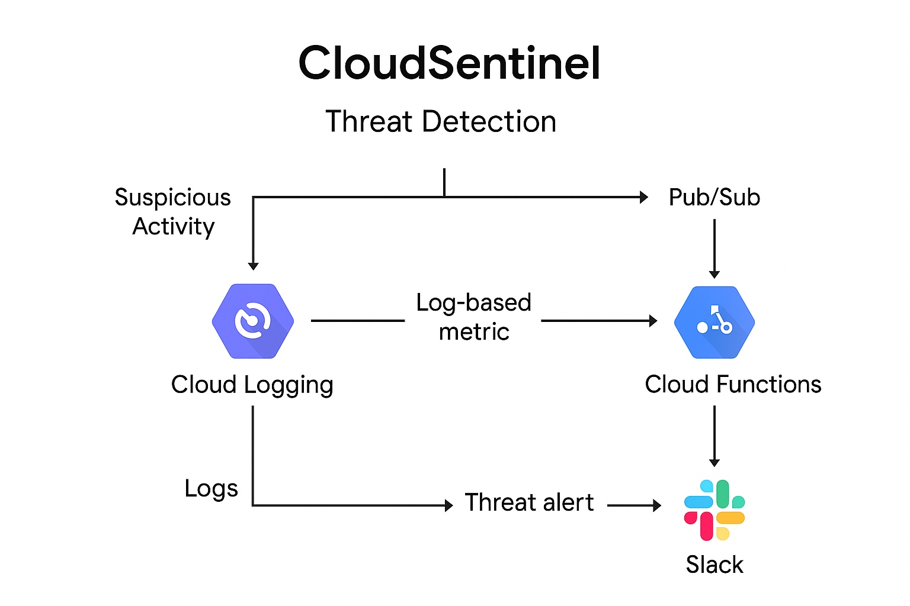

# CloudSentinel ✨

**CloudSentinel** is a professional-grade Google Cloud Security Monitoring pipeline designed for automated threat detection, real-time alerting (Slack), and centralized logging. Built using Terraform, Python, and native GCP services, it's tailored for cloud engineers and security professionals.

---

## 🚀 Project Overview

CloudSentinel detects and alerts on high-risk IAM and audit log activity across a Google Cloud project. It acts as a lightweight SIEM alternative showcasing:

* Event-driven Cloud Function
* Slack-based alerting
* Infrastructure as Code via Terraform

**Goal:** Help professionals like you land cloud security roles by demonstrating automation, detection, and monitoring on GCP.

---

## 📊 Architecture

## 📊 Architecture Diagram




```
[Audit Logs] --> [Log Sink] --> [Pub/Sub Topic] --> [Cloud Function] --> [Slack Alert]
```

* **Cloud Logging Sink** filters for high-risk events (e.g., IAM changes)
* **Pub/Sub** receives the filtered logs
* **Cloud Function** analyzes and forwards alerts to Slack

---

## 🤧 Technologies Used

* **Google Cloud Functions (Python 3.10)**
* **Cloud Pub/Sub**
* **Cloud Logging Sink**
* **Slack Incoming Webhooks**
* **Terraform** (Infrastructure as Code)

---

## 📚 Setup Instructions

### 1. Clone the Repository

```bash
git clone https://github.com/chrisclouds323/CloudSentinel.git
cd CloudSentinel/terraform
```

### 2. Configure Environment

Make sure you’re in the correct GCP project:

```bash
gcloud config set project YOUR_PROJECT_ID
```

Enable required services:

```bash
bash enable-apis.sh
```

### 3. Deploy Infrastructure

```bash
terraform init
terraform apply
```

This creates:

* Pub/Sub topic
* Log sink for threat events
* Cloud Function for detection and Slack alerts

---

## 📢 Slack Alert Demo

Once deployed, IAM changes like role modifications will trigger an alert.

Example message:

```json
[ALERT] IAM threat detected: SetIamPolicy
User: chrisvhicks@gmail.com removed roles/logging.viewer
```

Slack channel: `#all-che-security-solutions`

---

## 📈 Sample Output from Cloud Function Logs

```json
"severity": "NOTICE",
"timestamp": "2025-07-01T16:32:58Z",
"serviceName": "cloudresourcemanager.googleapis.com",
"action": "REMOVE",
"member": "user:chrisvhicks@gmail.com",
"role": "roles/logging.viewer"
```

---

## 🙌 Why It Matters

* Shows hands-on GCP security automation
* Combines logging, infrastructure as code, and real-time response
* Adds a portfolio-ready project to your GitHub

---

## ✨ Author

**Christopher V. Hicks**
Cloud Security Engineer | GCP Certified
GitHub: [chrisclouds323](https://github.com/chrisclouds323)
LinkedIn: [https://www.linkedin.com/in/chris-hicks-ba8765337](https://www.linkedin.com/in/chris-hicks-ba8765337)

---

## 🌐 License

MIT License
